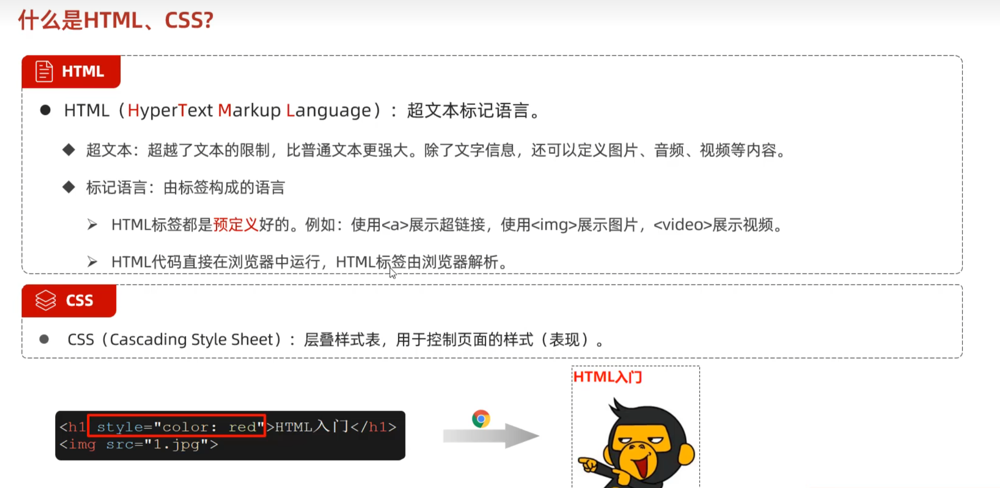
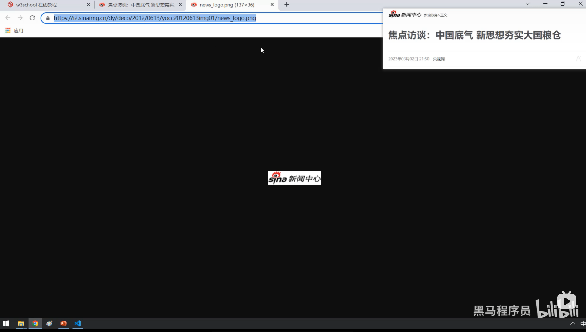
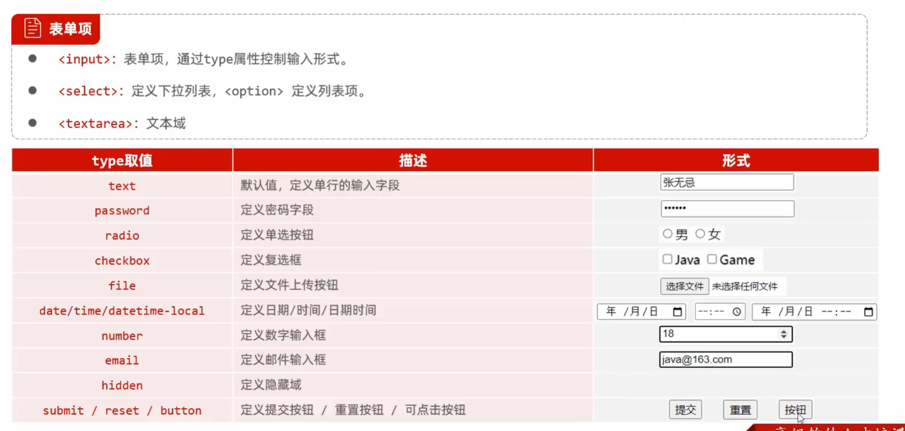
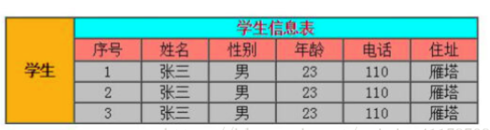

# HTML



## img

### 绝对网络路径



需保证互联网上有这张图片，且已联网

### width和height

只需给width或height两个其中一个数值，图片会等比例缩放

## 表单



### label

加上label标签以后，点击label标签内的任何区域，都可以聚焦到当前元素上

### radio（单选）

定义radio时，两个选项的name必须相同才能达到单选的效果

### 表格

想要写出如下表格时：



代码如下所示：

```html
<!DOCTYPE html>
<html lang="en">
<head>
    <meta charset="UTF-8">
    <title>学生信息表</title>
</head>
<body>

<table style="width: 60%;text-align: center;" cellspacing="2" cellpadding="3" border="1px">
    <tr>
        <td rowspan="5" style="background-color: darkorange">学生</td>
        <td colspan="6" style="background-color: aqua;color: red">学生信息表</td>
        <td>123</td>

    </tr>
    <tr style="background-color: salmon">
        <td>序号</td>
        <td>姓名</td>
        <td>性别</td>
        <td>年龄</td>
        <td>电话</td>
        <td>住址</td>
    </tr>
    <tr style="background-color: darkgray">
        <td>1</td>
        <td>张三</td>
        <td>男</td>
        <td>23</td>
        <td>110</td>
        <td>雁塔</td>
    </tr>
    <tr style="background-color: darkgray">
        <td>2</td>
        <td>张三</td>
        <td>男</td>
        <td>23</td>
        <td>110</td>
        <td>雁塔</td>
    </tr>
    <tr style="background-color: darkgray">
        <td>3</td>
        <td>张三</td>
        <td>男</td>
        <td>23</td>
        <td>110</td>
        <td>雁塔</td>
    </tr>

</table>
</body>
</html>
```
