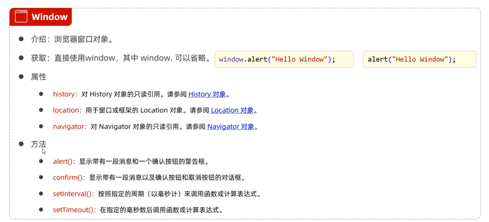
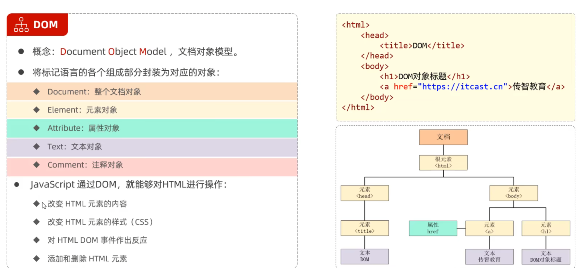

# JavaScript

## 箭头函数


## 输出语句


## 变量

var：

* 作用域比较大，全局变量
* 可以重复定义


## 数据类型


## 运算符


## 函数

两种定义方式：


## Js对象

* Array
* String
* JSON
* BOM
* DOM

### 数组Array


特点：

* 长度可变
* 类型可变

如下列代码：

```java
var arr = [1,2,3,4];
arr[10] = 50;
console.log(arr[8]);
```

输出为undefined

#### 常用属性和方法


### String


### JSON

#### 自定义对象


#### JSON对象


不使用xml：数据较为臃肿，标签过多


##### JSON对象和字符串互相转换


### BOM


#### Window



#### Location


### DOM

JS通过DOM和事件监听机制来控制网页的行为




## Js事件监听

### 事件绑定


### 常见事件


