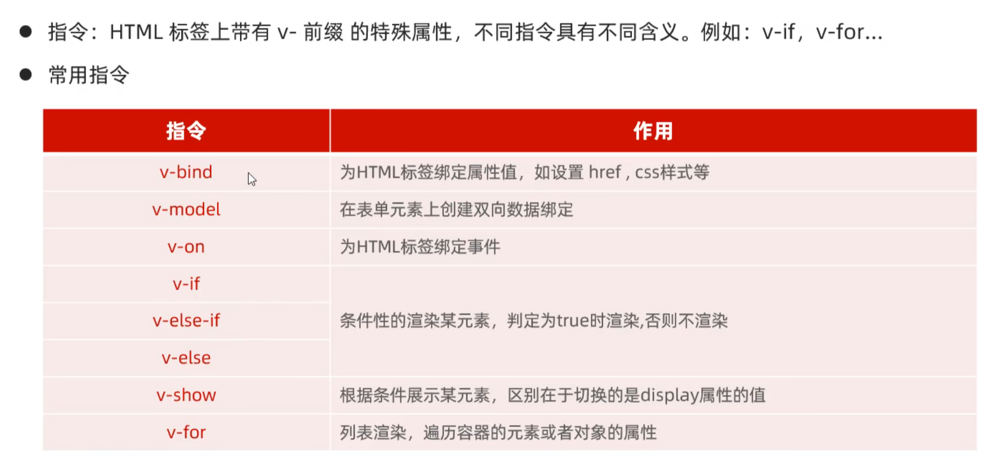

# Vue


## 常用指令



### v-bind和v-model

* v-bind

```html
<a v-bind:href = "url">教育网站</a>
<a :href = "url">教育网站</a>
``` 

* v-model

```html
<input type = "text" v-model = "url">
```

如下列代码：


当使用v-model和v-bind配合使用时，可形成如下效果：


在输入框中输入不同的url时，链接将会指向输入的url。

>因为输入框中的url和数据模型进行了双向绑定，当输入框中的url改变时，数据模型中的url也会改变，而v-bind绑定了数据模型，因此链接也会改变


### v-on


### v-if和v-show


>v-if 是“真正”的条件渲染，因为它会确保在切换过程中条件块内的事件监听器和子组件适当地被销毁和重建。
> v-show 就简单得多——不管初始条件是什么，元素总是会被渲染，并且只是简单地基于 CSS 进行切换。

### v-for


