# maven

## maven作用

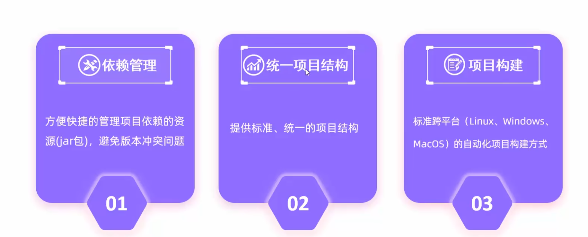

## 配置maven环境

配置idea的maven设置

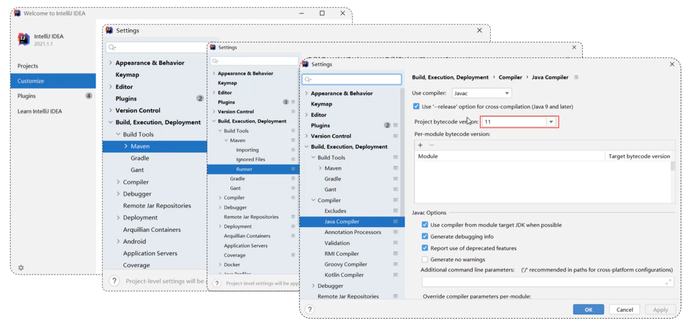

### idea创建maven项目

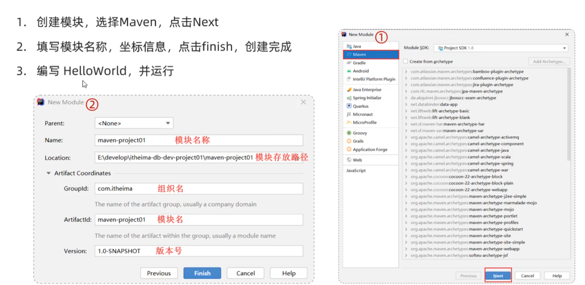

### maven坐标

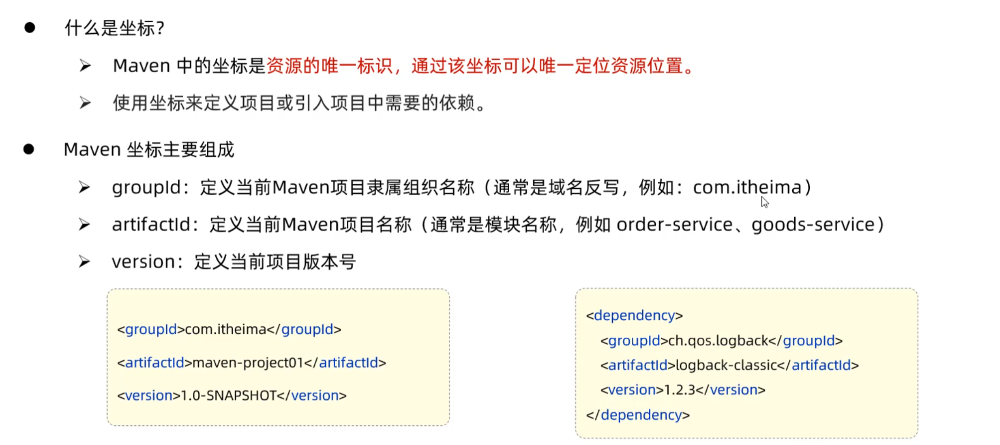

### 导入maven项目

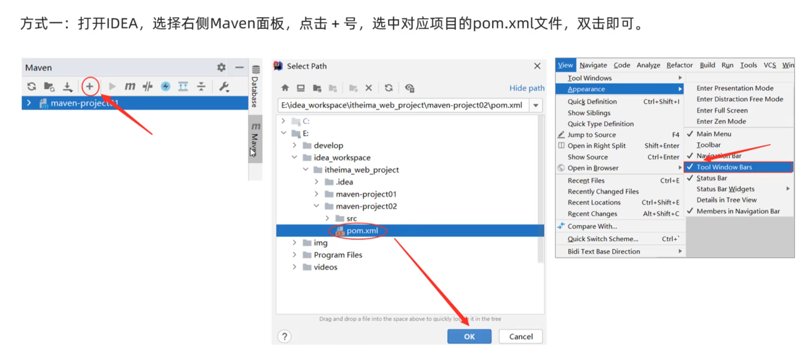

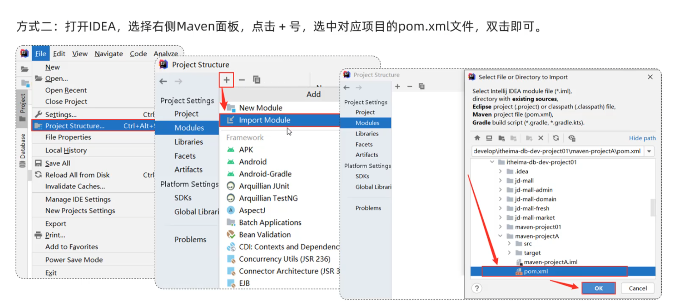

## 依赖管理

### 依赖配置

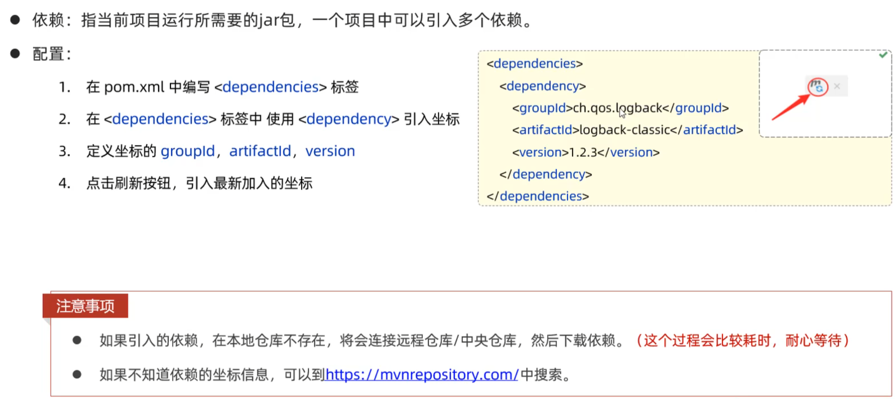

### 依赖传递

依赖具有传递性

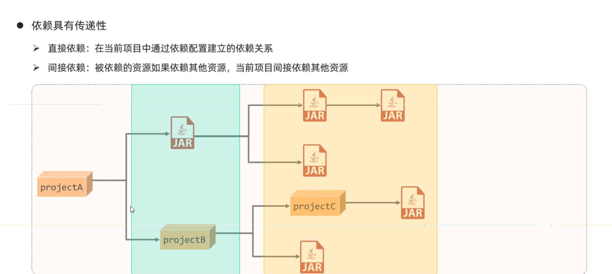

#### 排除依赖

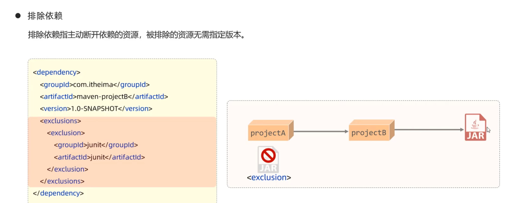

### 依赖范围

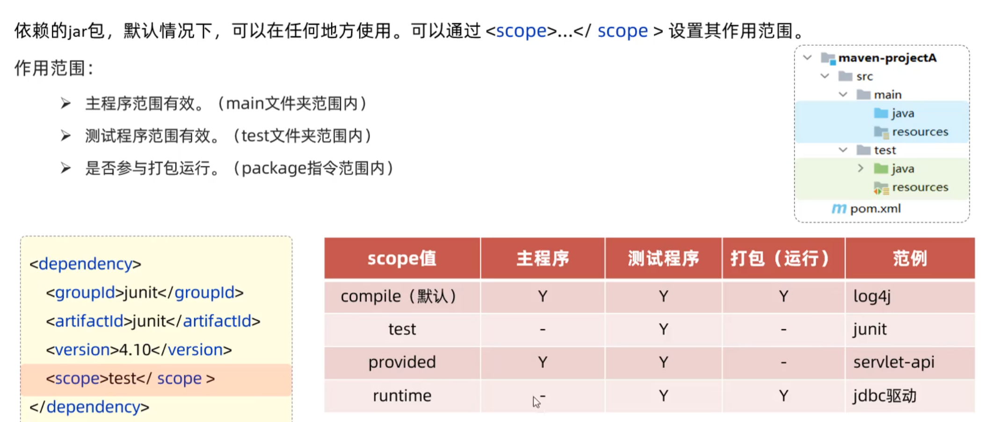

打包范围无效指的是打包以后，不会将无效的jar包放在文件夹中

### 生命周期

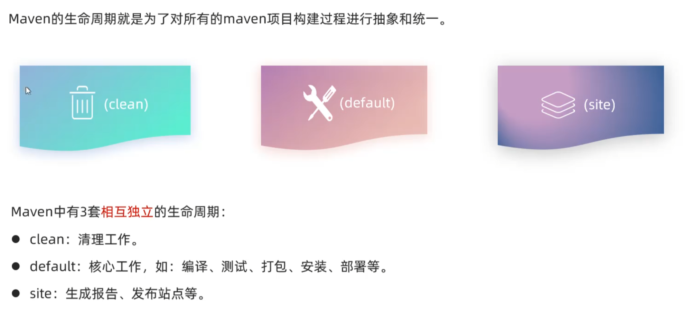

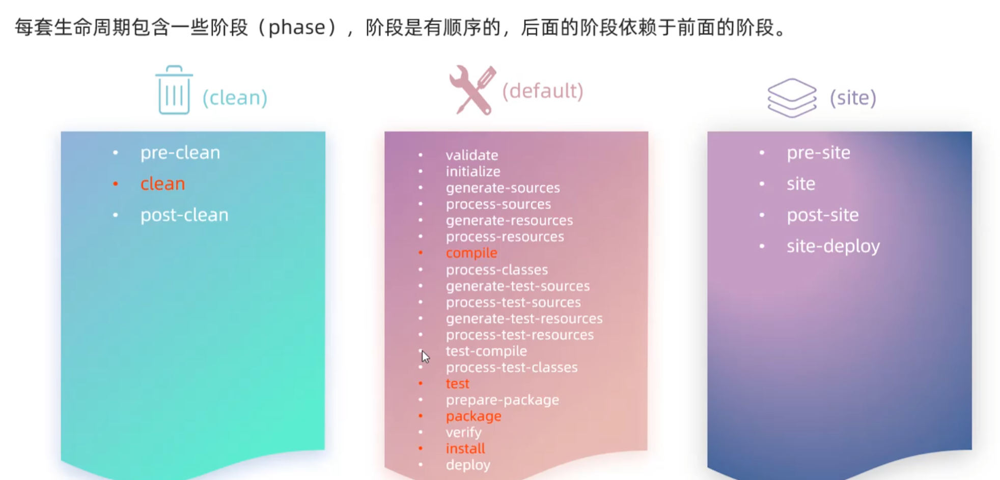

 maven的install可以将项目本身编译并打包到本地仓库，这样其他项目引用本项目的jar包时不用去私服上下载jar包，直接从本地就可以拿到刚刚编译打包好的项目的jar包，很灵活，避免每次都需要重新往私服发布jar包的痛苦。

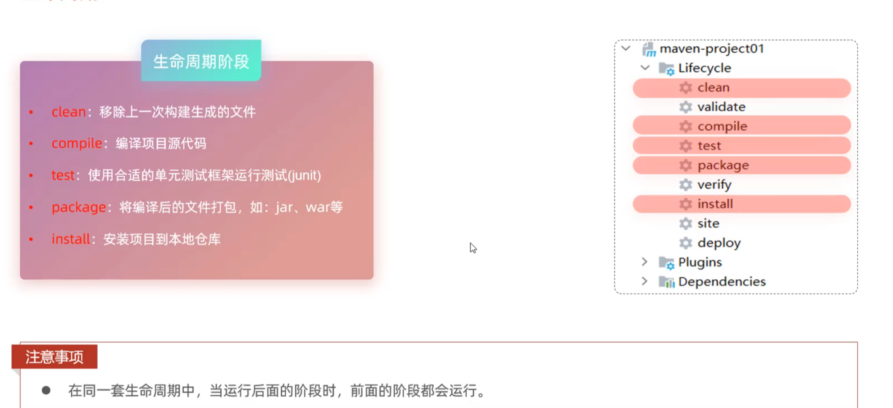

> 执行clean后面的阶段时，clean并不会执行，因为clean和后面的不属于同一套生命周期

#### 执行生命周期的方式

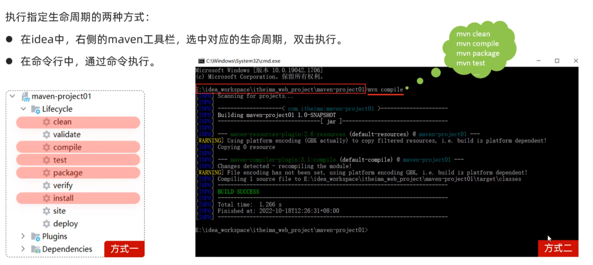

>maven是基于插件的框架，因此所有生命周期本质上都是使用插件完成的

若想跳过某个阶段不执行，可在idea中点击“小闪电”跳过