# web入门

## sprintboot入门

sprintboot可以帮助我们非常快速的构建应用程序、简化开发、提高效率

>底层任是sprint框架

### 创建sprintboot工程

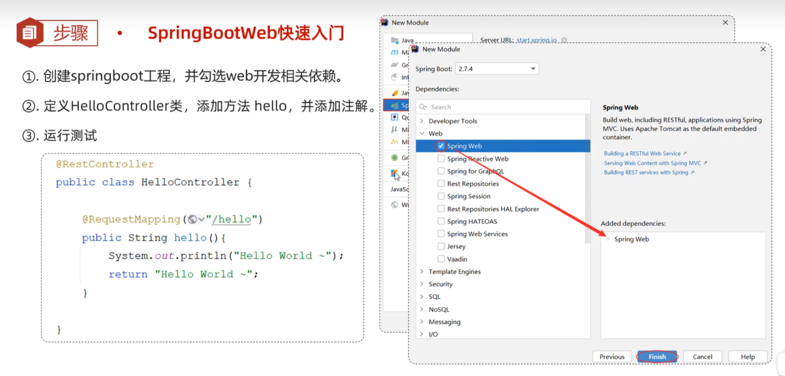

>需要将java文件设置为“将目录标记为源代码根目录”

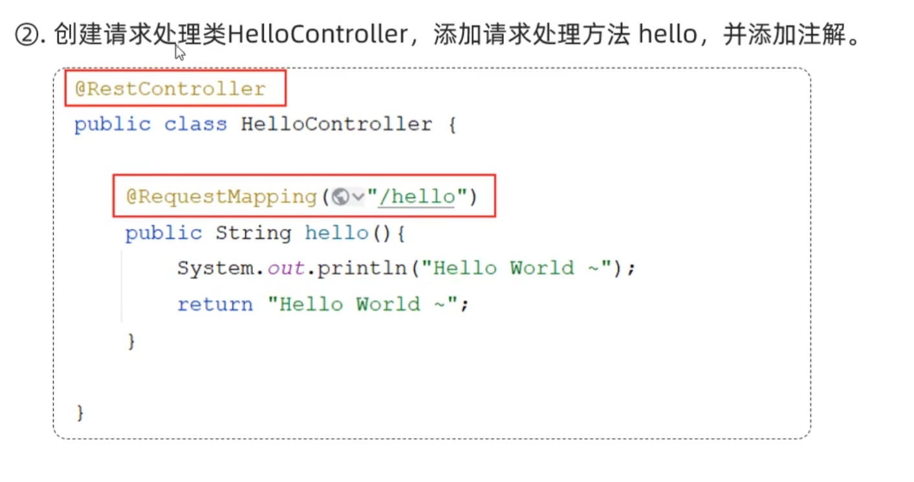

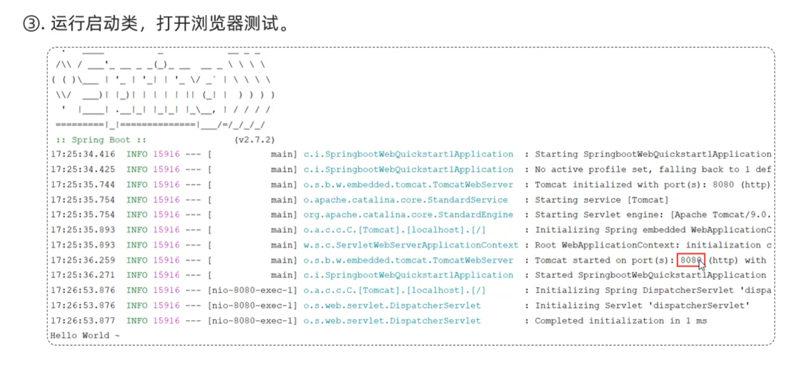

## HTTP协议

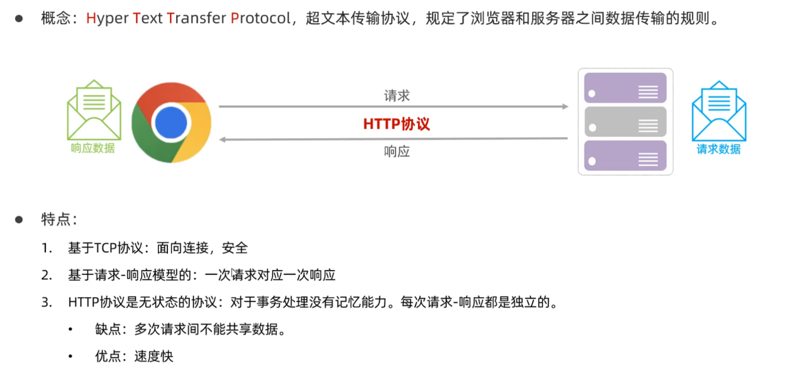

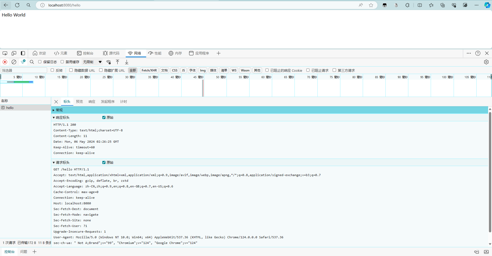

### 关于对HTTP的理解

HTTP的请求响应可以概括为浏览器携带一些参数请求服务器处理，服务器将处理后的参数响应给浏览器 吗？

>是的，您对HTTP请求和响应的概括是正确的。

>在HTTP通信中，客户端（通常是浏览器）向服务器发送请求，请求中包含了一些参数或数据，如URL、请求方法（GET、POST等）、请求头部等。这些参数可以用于指定服务器需要执行的操作，传递数据或者请求特定资源。

>服务器接收到请求后，会根据请求中的参数进行相应的处理。处理的方式可以包括执行特定的操作、查询数据库、生成动态内容等。处理完成后，服务器会生成一个HTTP响应，其中包含了响应状态码、响应头部和响应体。

>响应状态码指示了请求的处理结果，如200表示成功，404表示资源未找到等。响应头部包含了一些元信息，如响应的内容类型、长度、编码方式等。响应体则是服务器返回给客户端的实际内容，如HTML页面、JSON数据等。

>一旦服务器生成了HTTP响应，它会将响应发送回客户端（即浏览器），浏览器会解析响应并根据响应的内容进行相应的处理，如显示网页内容、处理数据等。

>因此，HTTP请求和响应确实是浏览器携带参数请求服务器处理，服务器将处理后的参数或数据响应给浏览器的过程。

### 请求协议

#### 请求数据格式

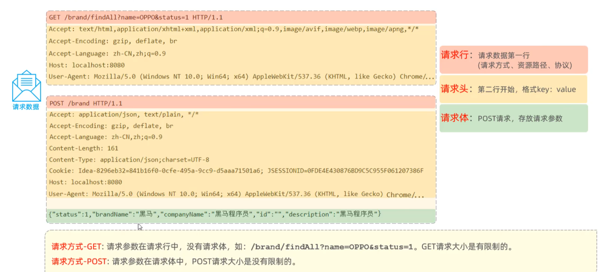

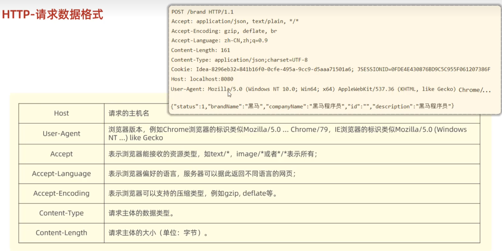

### 响应协议

#### 响应数据格式

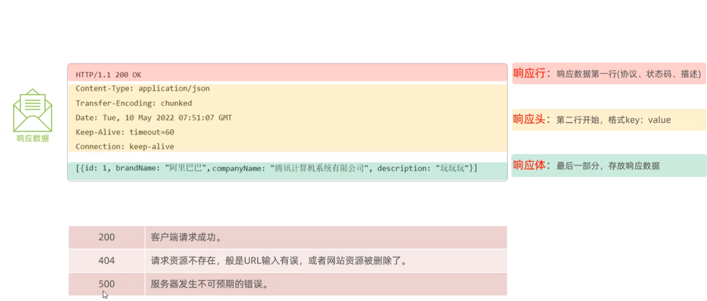

#### 响应状态码

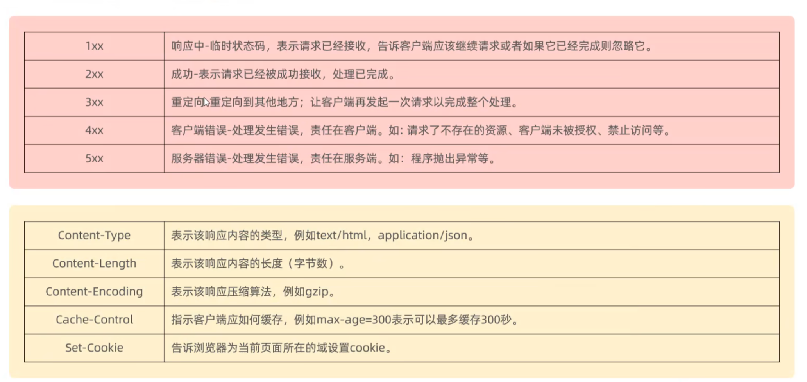

>重定向：服务器的资源可能已经被移动（也可能是同一台服务器，只是位置不同），此时当客户端发起请求时，服务端会返回3xx并返回一个新的路径，这时客户端将会自动继续访问该新路径

常见的响应状态码：

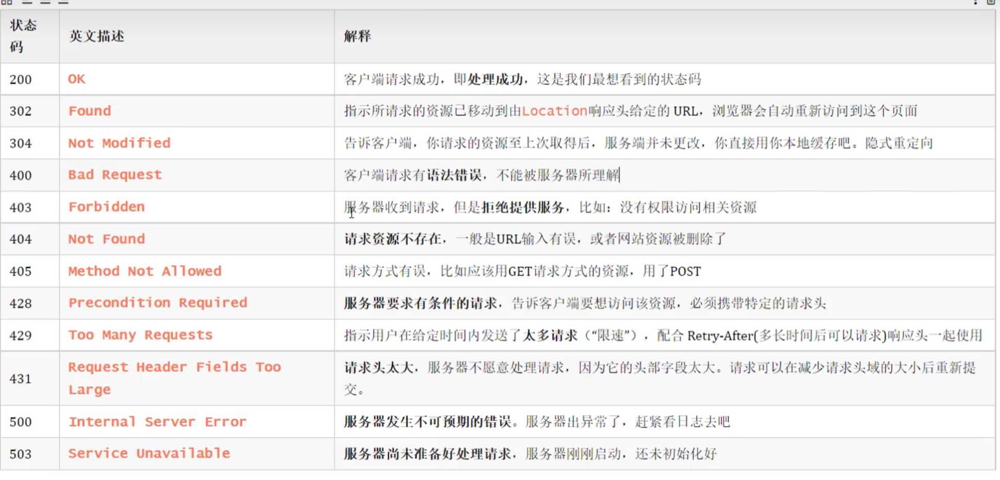

### 解析协议

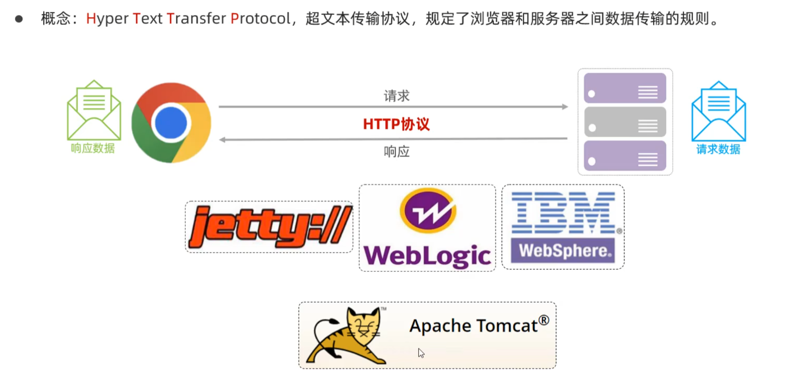

## web服务器

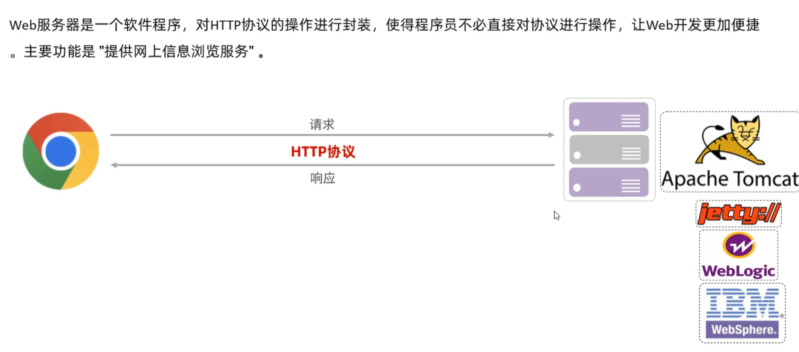

>当浏览器需要一个托管在网络服务器上的文件的时候，浏览器通过 HTTP 请求这个文件。当这个请求到达正确的 web 服务器（硬件）时，HTTP 服务器（软件）收到这个请求，找到这个被请求的文档（如果这个文档不存在，那么将返回一个 404 响应），并把这个文档通过 HTTP 发送给浏览器。

>当你创建一个网站时，就需要部署一个web服务器，并将想要展示的页面（文件）放在服务器上

### Tomcat基本使用

* 部署项目：
将项目放置到webapps目录下，即部署完成

## 入门程序解析

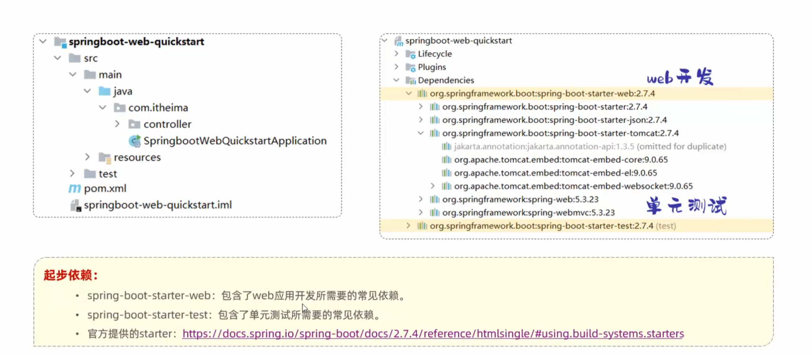

>基于Sprintboot开发的web应用程序，内置了Tomcat服务器，当启动类运行时，即可启动内嵌Tomcat