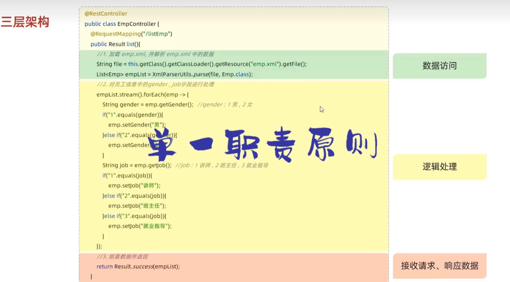
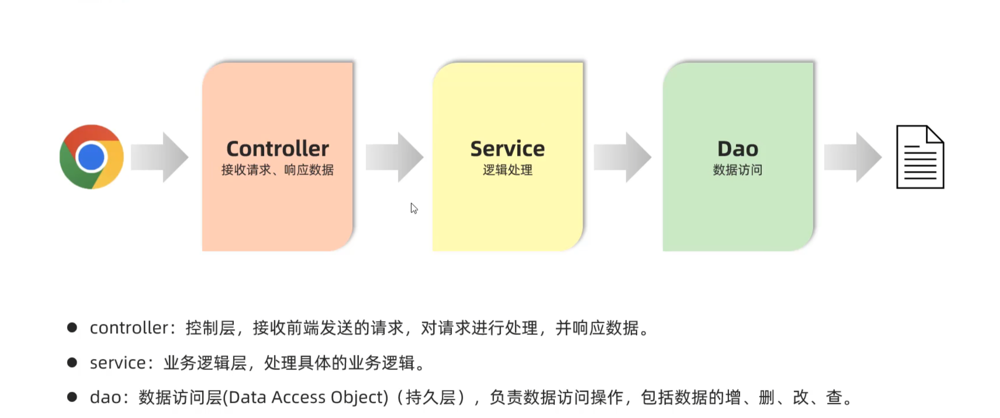
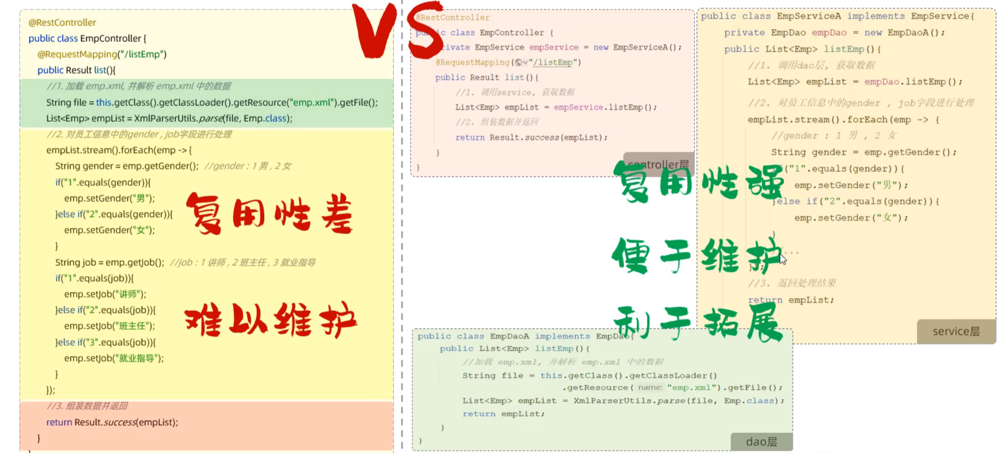
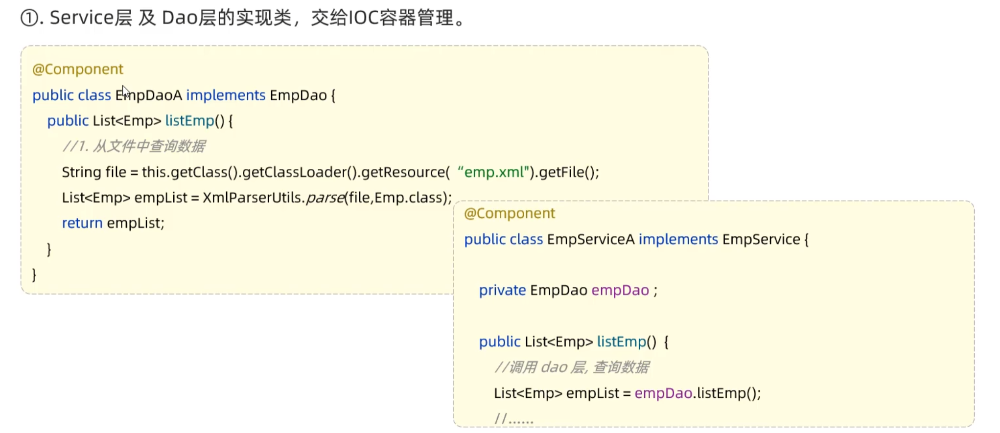
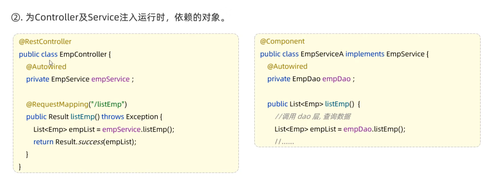

# 分层解耦

## 三层架构

## IOC-DI

在原代码中，若将Service中的EmpServiceA改为EmpServiceB，则Controller中的EmpService也需要改变，因此**此处Service层和Controller层耦合了**，故采用IOC-DI方式分层解耦

### 具体实现

* @Component
  * 将当前类交给IOC容器管理，成为IOC容器中的bean --**控制反转**

* @AutoWired
  * 运行时，ICO容器会提供该类型的bean对象，并赋值给该变量 -- **依赖注入**

