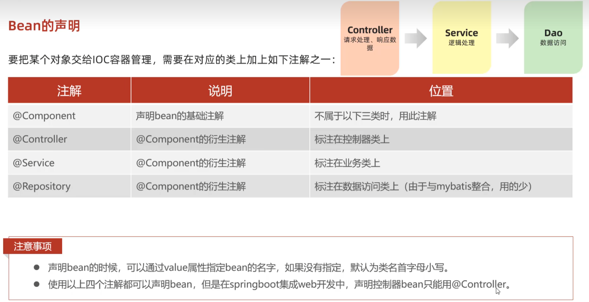
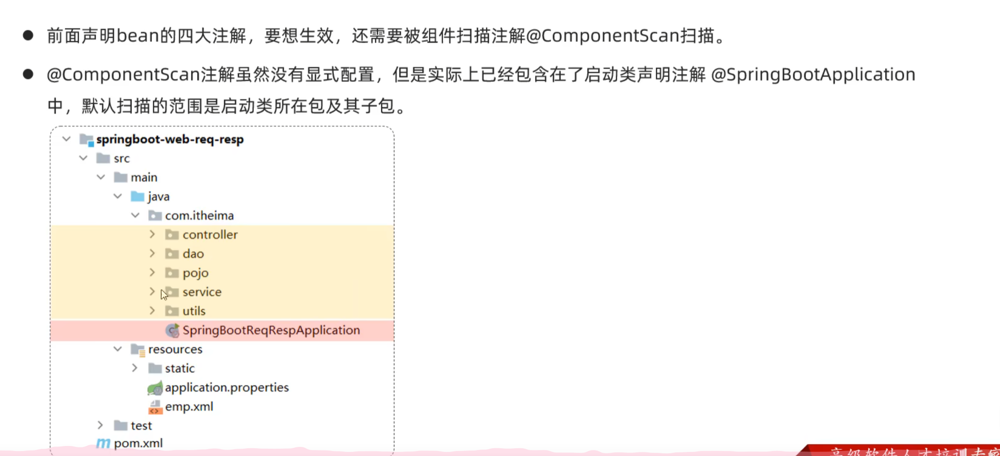
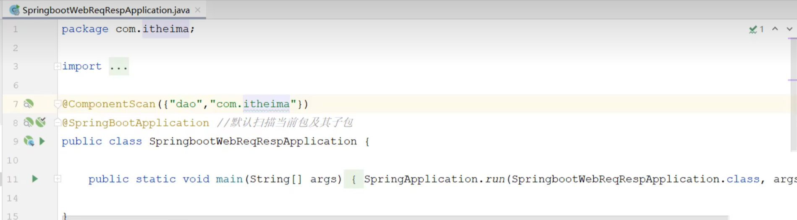

# 分层解耦

## 三层架构

## IOC-DI

在原代码中，若将Service中的EmpServiceA改为EmpServiceB，则Controller中的EmpService也需要改变，因此**此处Service层和Controller层耦合了**，故采用IOC-DI方式分层解耦

### 具体实现

* @Component
  * 将当前类交给IOC容器管理，成为IOC容器中的bean --**控制反转**

* @AutoWired
  * 运行时，ICO容器会提供该类型的bean对象，并赋值给该变量 -- **依赖注入**

### Bean的声明

### Bean组件扫描

两种解决方式：

1. 在启动类中手动设置@ComponentScan（不推荐）

2. 按照规范将所写代码放在**启动类所在包及其子包下**（推荐）

### Bean注入

* @Primary：放在bean上，代表优先注入此bean
* @Qualifier：在参数中指定需要注入的bean的名字，和@Autowired一起使用（bean的名字默认首字母小写）
* @Resource：在参数中指定需要注入的bean的名字，单独使用

