# 请求响应

>请求响应就是：浏览器携带一些参数请求服务器处理，服务器将处理后的参数响应给浏览器

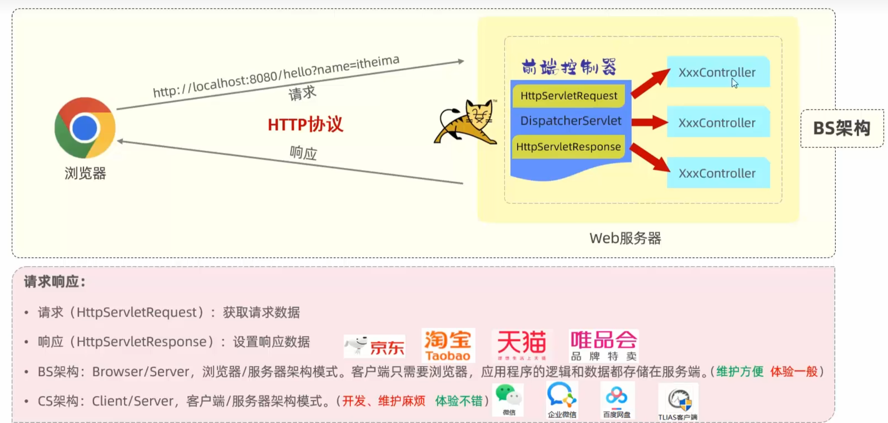

## postman

postman是一款功能强大的网页调试与发送网页HTTP请求的Chrome插件
作用：常用于进行接口测试

>poatman相当于浏览器，负责发送数据并请求数据；Java程序相当于服务端，负责处理数据并响应数据

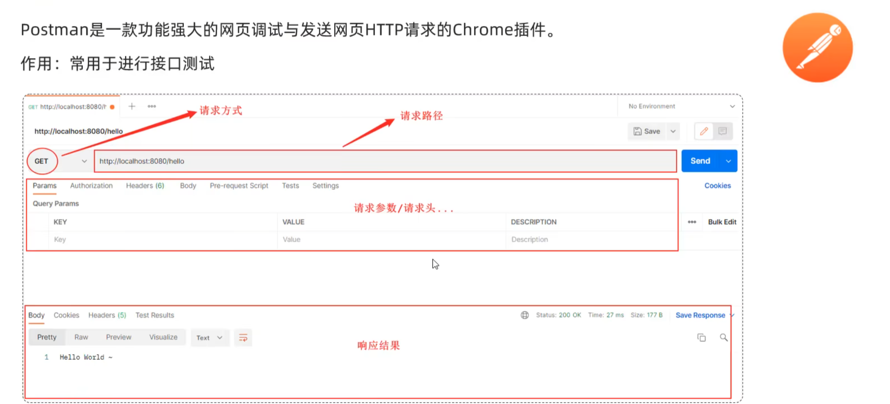

## 简单参数

* 原始方式

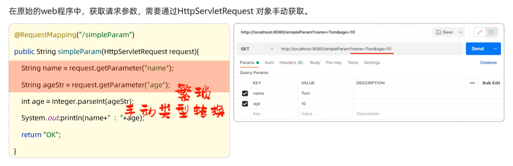

* sprintboot方式

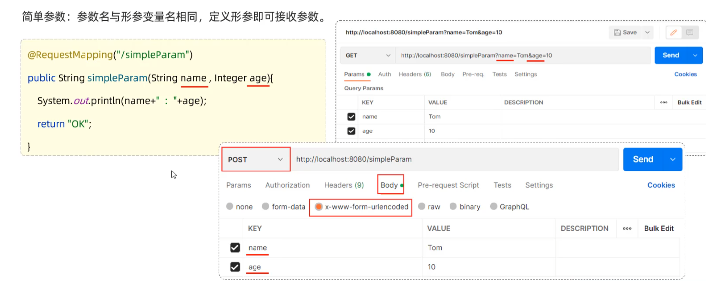

>只需形参名相同即可接受

* sprintboot方式（形参名不相同）

>若传递的参数和形参名不相同，不会报错，但无法正常接收

## 实体参数

* 简单实体对象

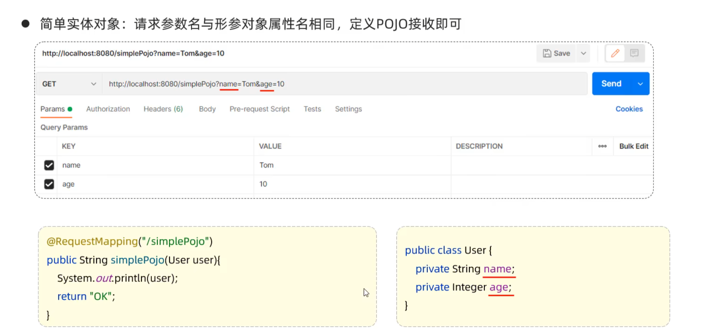

* 复杂实体对象

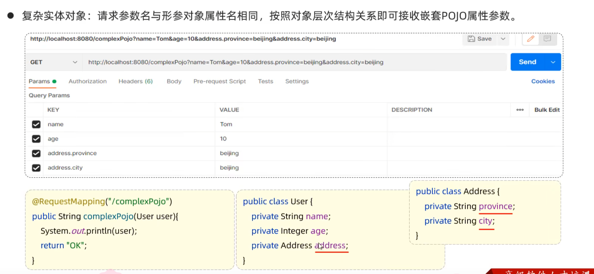

## 数组集合参数

* 数组参数

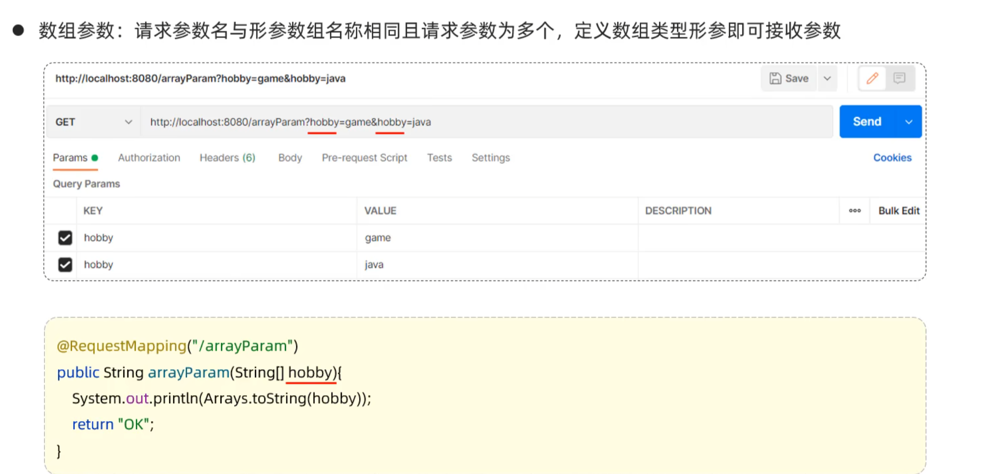

* 集合参数

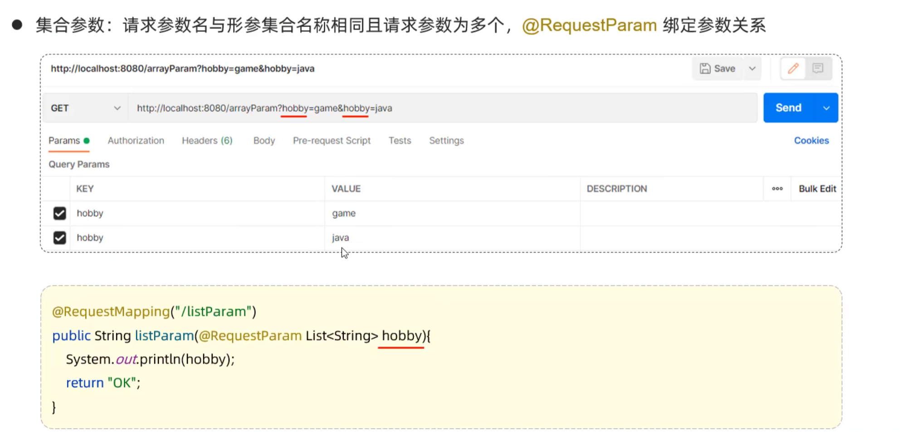

>默认形参内的为数组，加上注解@RequestParam后就变为集合

## 日期参数

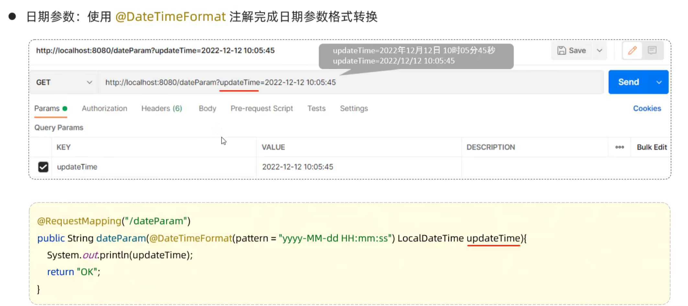

>使用@DateTimeFormat注解规定传递的日期时间格式

## Json参数

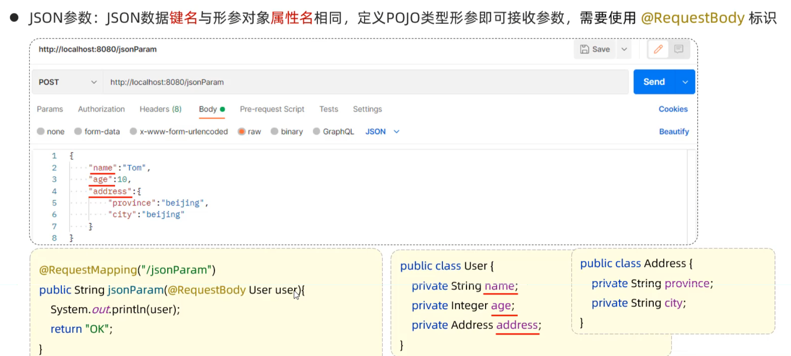

## 路径参数

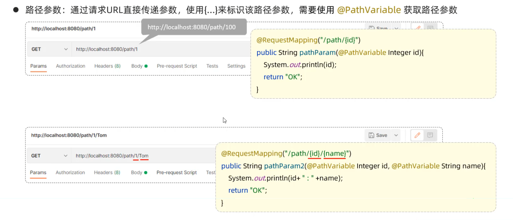

## 响应数据

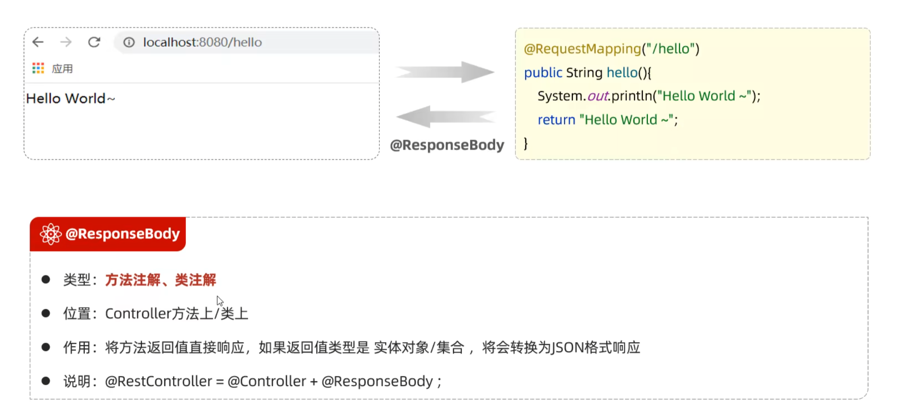

### 统一响应结果

