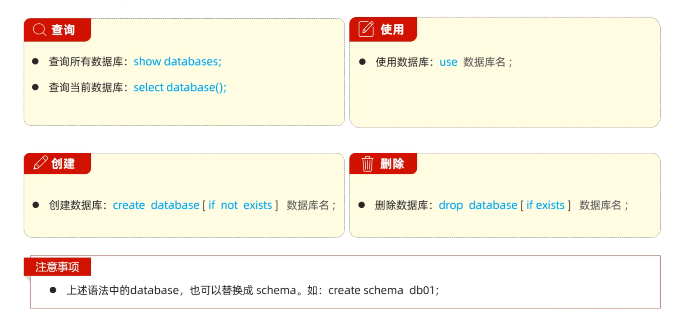
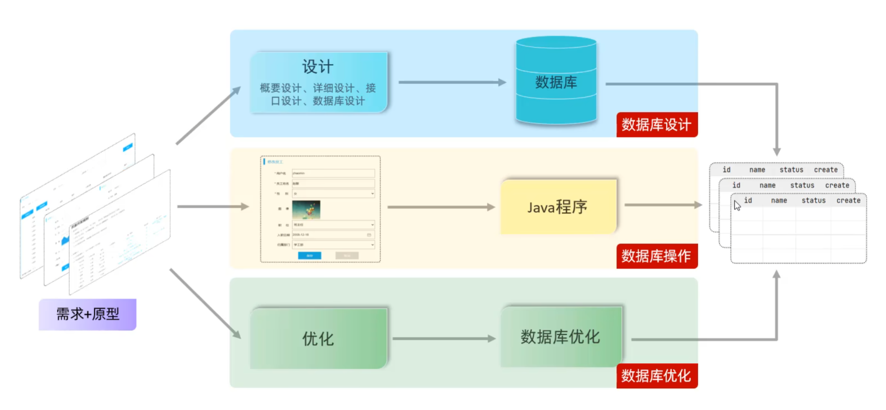
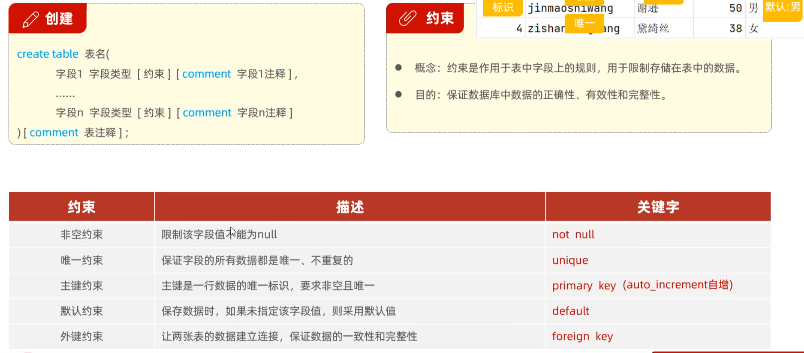
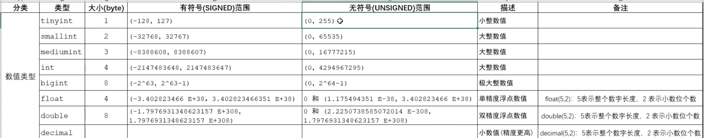
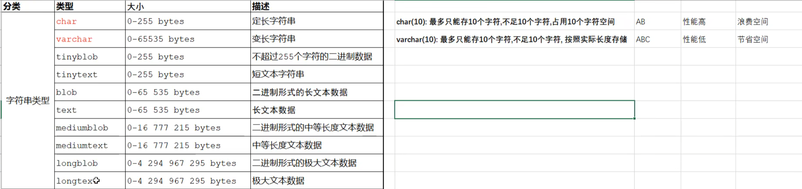
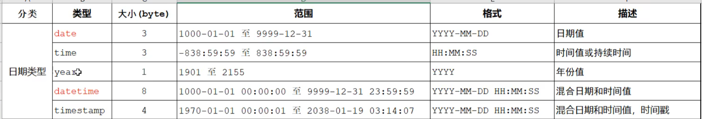
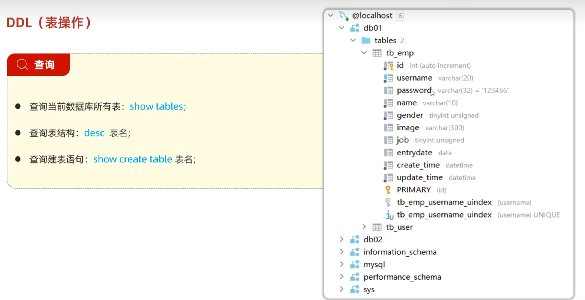
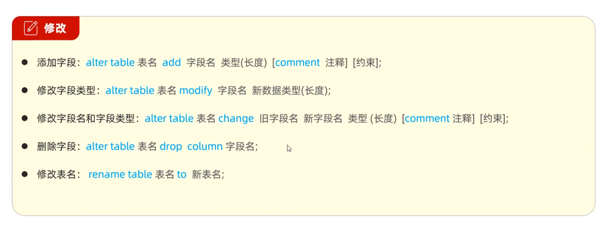
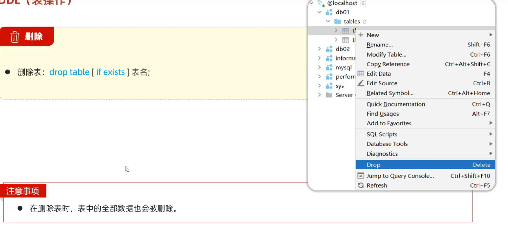

# Mysql-DDL

## 数据库的创建、查询、使用、删除

软件开发流程中对数据库的流程：

>DDL语句对应了第一步，即对数据库的表结构进行设计

## DDL语句

>负责对表结构进行操作

## 表结构的创建、查询、修改、删除

### 创建

### 数据类型

分为数值类型，字符串类型，日期时间类型

>选择数据类型时，尽量选择占用内存空间小的类型

#### 数值类型

#### 字符串类型

#### 日期时间类型

### 查询

### 修改

### 删除

