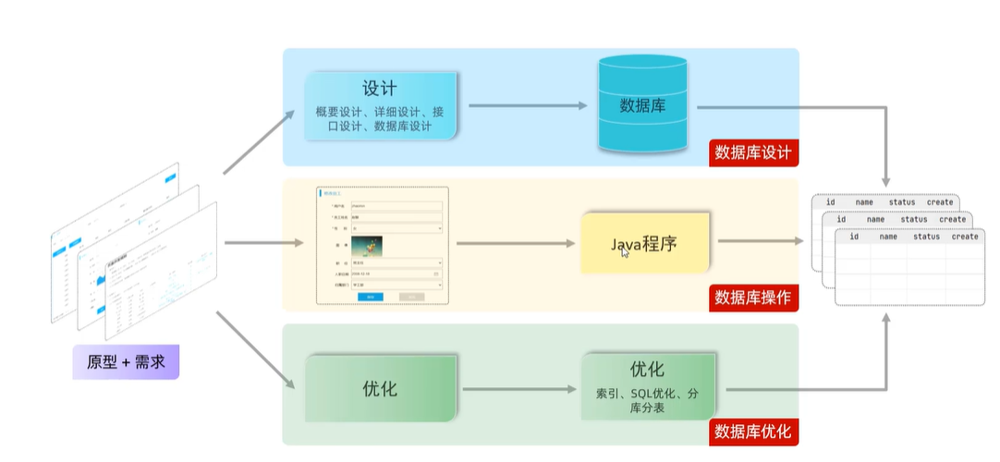
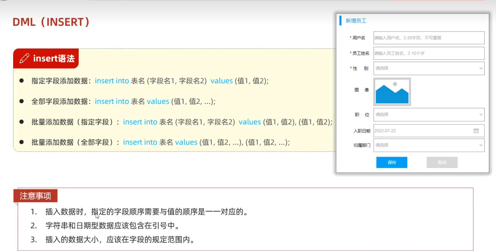
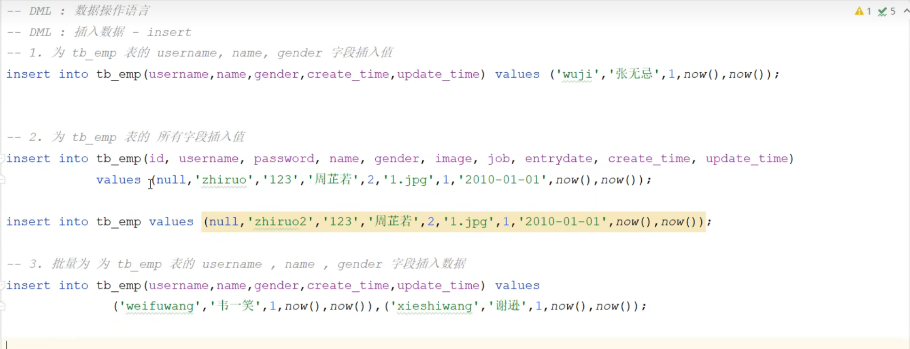
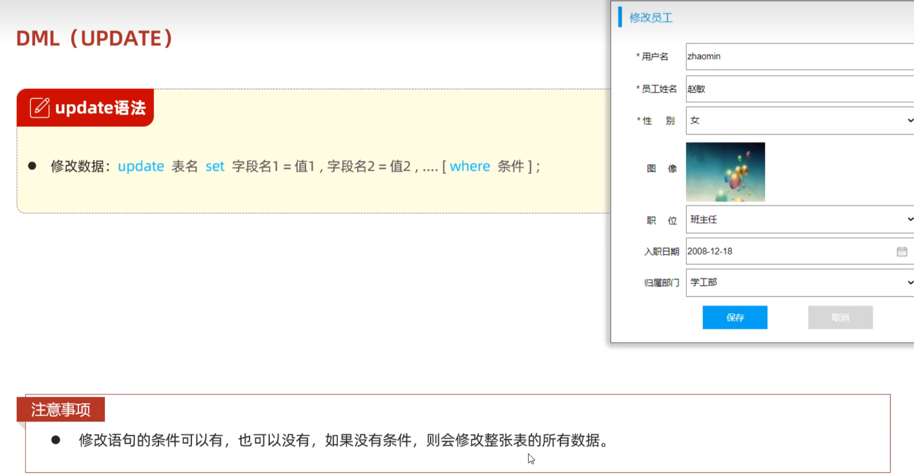
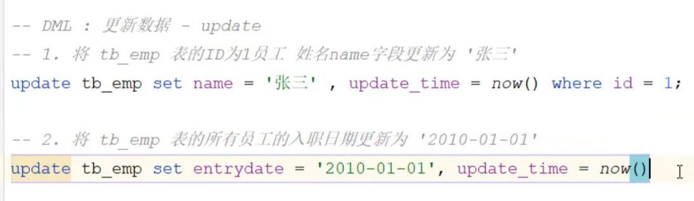
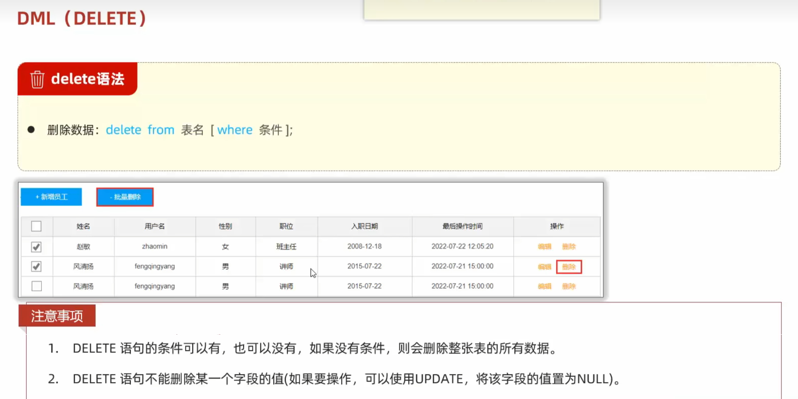
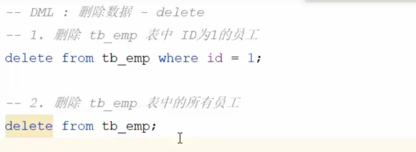

# Mysql-DML

软件开发流程中对数据库的流程：

>DML语句对应了第二步数据库操作部分，即对数据库中的数据进行操作

## 添加数据insert

>每一次创建数据时都需要更新update_time及create_time，可使用now()作为此时的时间

### 案例

>若该字段为主键自增（如id字段），则可以将其设为null，mysql会自动填写

## 更新数据update

>每一次更新数据时都需要更新update_time，可使用now()作为此时的时间

### 案例

## 删除数据delete

### 案例

