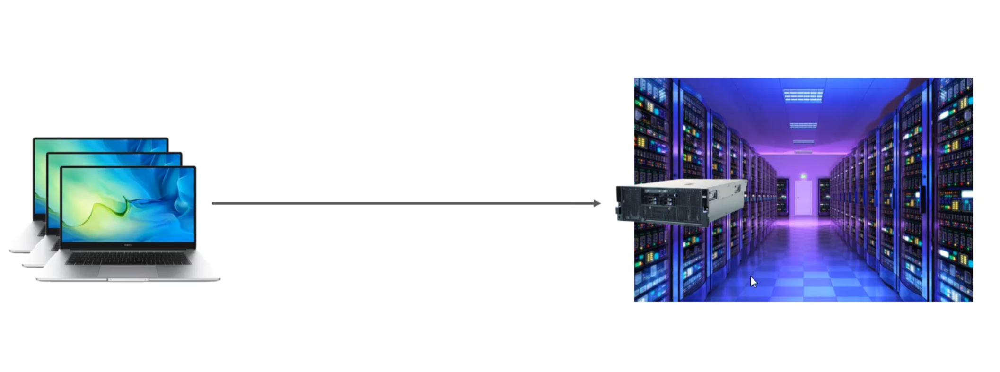
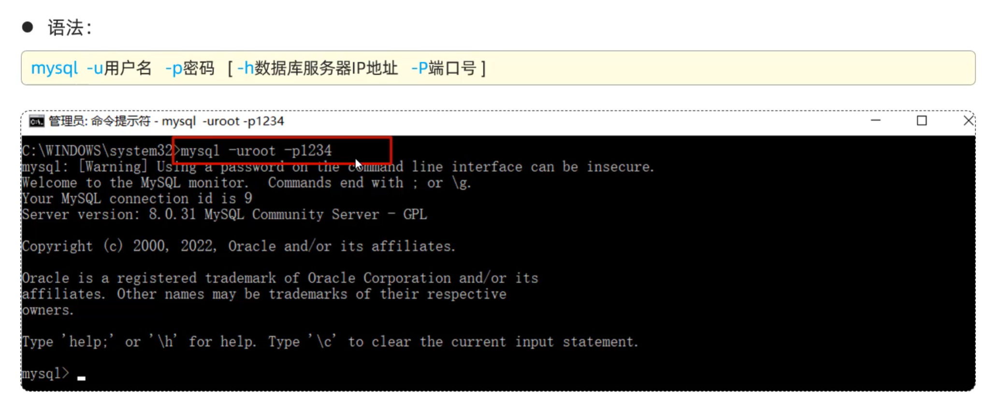
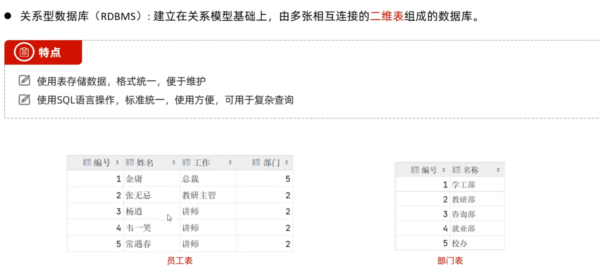
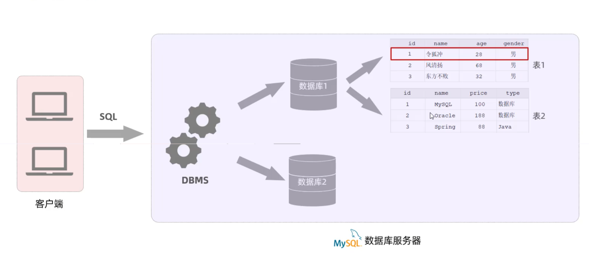
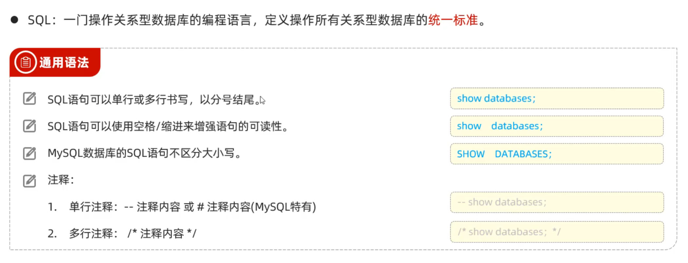
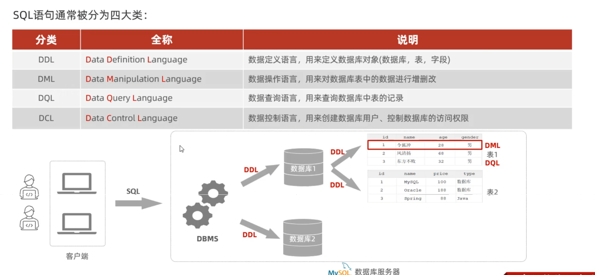

# Mysql概述

* DB：数据库，是存储和管理数据的仓库
* DBMS：数据库管理系统，操作和管理数据库的大型软件
* SQL：操作关系型数据库的编程语言，定义了一套操作关系型数据库统一标准

>在企业中，一般将Mysql装在一个专用的服务器上，并托管在一个机房当中，若想要访问该服务器，只需要使用Mysql的客户端远程访问即可

## Mysql常用命令

* Mysql连接：

* 创建数据库
>create database db01/db02...;

* 启动Mysql服务
>net start mysql

* 关闭Mysql服务
>net stop mysql

安装完数据库后，需要：

* 查看是否配置环境变量成功：
>mysql

* 初始化数据库（生成data文件）
>mysqld --initialize-insecure

* 安装mysqld服务
>mysqld -install

## Mysql数据模型

在自己的电脑上启动 MySQL 服务，它实际上是将你的电脑作为数据库服务器。你的电脑会同时充当客户端和服务器的角色。

当你启动 MySQL 服务后，它会在你的电脑上运行一个 MySQL 服务器实例，该实例负责接受来自客户端的连接请求，并处理这些请求。此时，你的电脑就成为一个本地的数据库服务器，可以处理与数据库相关的操作。

作为客户端，你可以使用 MySQL 客户端软件（如命令行工具、图形界面工具等）连接到本地的 MySQL 服务器，并执行各种数据库操作，如创建数据库、表、插入数据、查询数据等。你可以使用客户端来管理和操作本地的 MySQL 服务器。

总结来说，在自己的电脑上启动 MySQL 服务意味着你的电脑同时扮演了客户端和数据库服务器的角色，你可以通过客户端连接到本地的 MySQL 服务器，并对其进行操作和管理。

## SQL简介

## SQL分类

