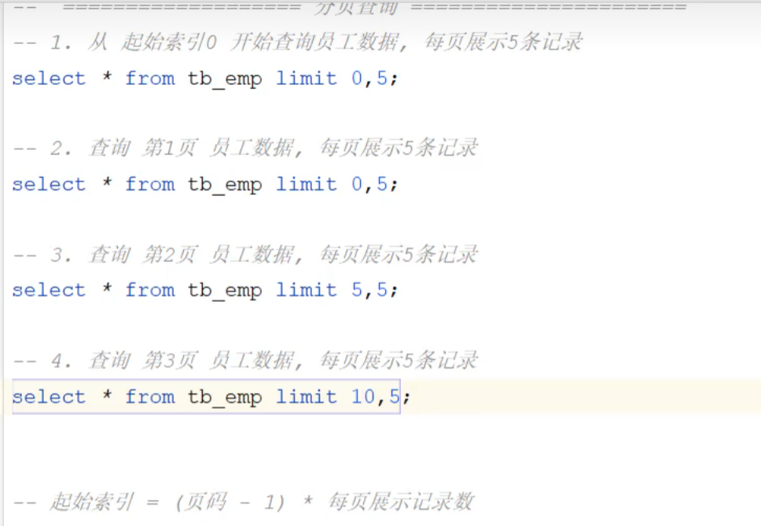

# Mysql-DQL

软件开发流程中对数据库的流程：

>DQL语句对应了第二步数据库操作部分中的查，即对数据库中的数据进行查操作

## 基本查询（select from）

### 查询所有字段

### 设置别名

* as可以省略
* 如果别名中有空格或特殊符号，需加单引号或双引号

## 条件查询（where）

## 分组查询中的聚合函数

### 关于count

* count不对null值进行运算
* 对于重复行，Count(* )  可以识别并计算重复行，这是因为它对所有行进行了计数。而Count(1)只关心行的存在与否，不处理行的内容。因此，如果查询结果中存在重复行，Count(1)将无法区分它们并进行计数，而Count(* )可以准确计算。

#### COUNT(*)和COUNT(1)

介绍完了COUNT(*)，接下来看看COUNT(1)，对于，这二者到底有没有区别，网上的说法众说纷纭。

有的说COUNT(*)执行时会转换成COUNT(1)，所以COUNT(1)少了转换步骤，所以更快。

还有的说，因为MySQL针对COUNT(*)做了特殊优化，所以COUNT(*)更快。

那么，到底哪种说法是对的呢？看下MySQL官方文档是怎么说的：

    InnoDB handles SELECT COUNT(*) and SELECT COUNT(1) operations in the same way. There is no performance difference.

画重点：same way , no performance difference。所以，对于COUNT(1)和COUNT(*)，MySQL的优化是完全一样的，根本不存在谁比谁快！

那既然COUNT(*)和COUNT(1)一样，建议用哪个呢？

建议使用COUNT(*)！因为这个是SQL92定义的标准统计行数的语法，而且本文只是基于MySQL做了分析，关于Oracle中的这个问题，也是众说纷纭的呢。
 
————————————————

                            版权声明：本文为博主原创文章，遵循 CC 4.0 BY-SA 版权协议，转载请附上原文出处链接和本声明。
                        
原文链接：https://blog.csdn.net/pyzfirst/article/details/108521334

## 分组查询（group by having）

>分组查询中，select后包含的字段包括分组字段和聚合函数

## 排序查询（order by）

## 分页查询（limit）

