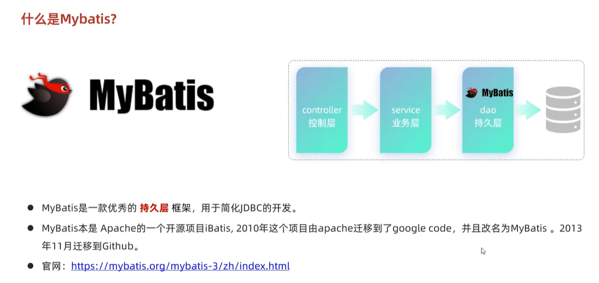
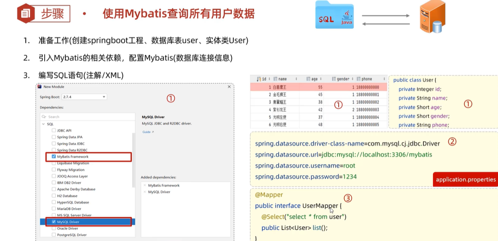
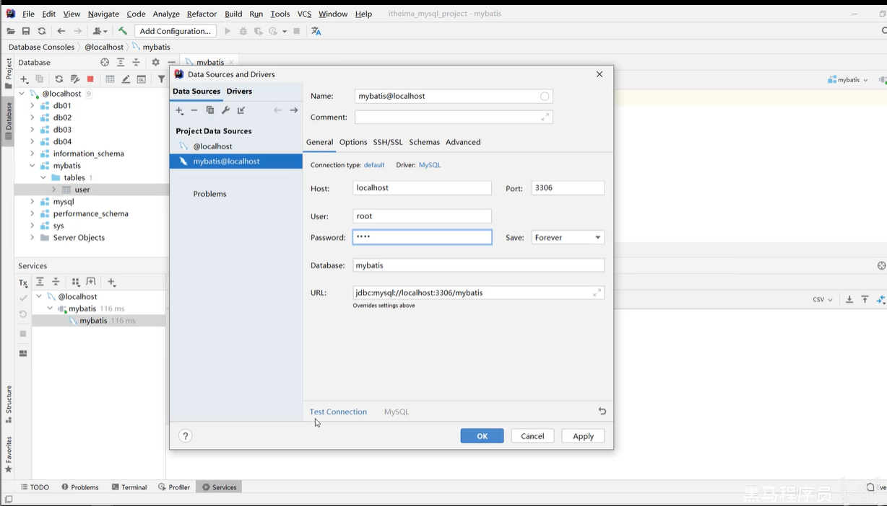
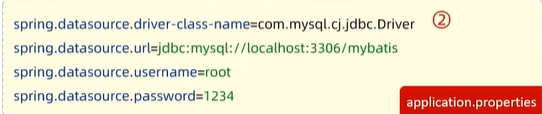

# Mybatis入门

## 什么是Mybatis

## 入门程序

## 数据库连接

* Driver：数据库驱动，MySQL为数据库驱动类的类名，若需连接MySQL数据库，则数据库的类名是固定的，为：com.mysql.cj.jdbc.Driver
* URL：
  * jdbc:mysql://是协议部分，是固定的；
  * localhost:3306代表了要连接的是哪个数据库服务器，表示本机的3306端口
  * mybatis表示要连接哪个数据库

### 数据库连接四要素

application.properties文件：

