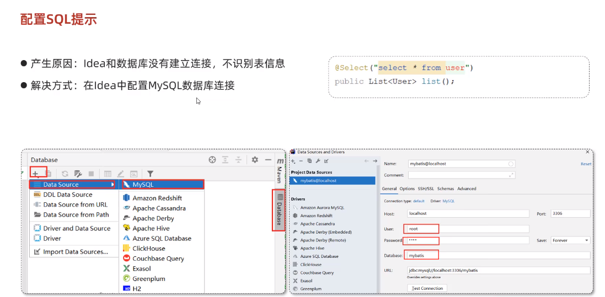
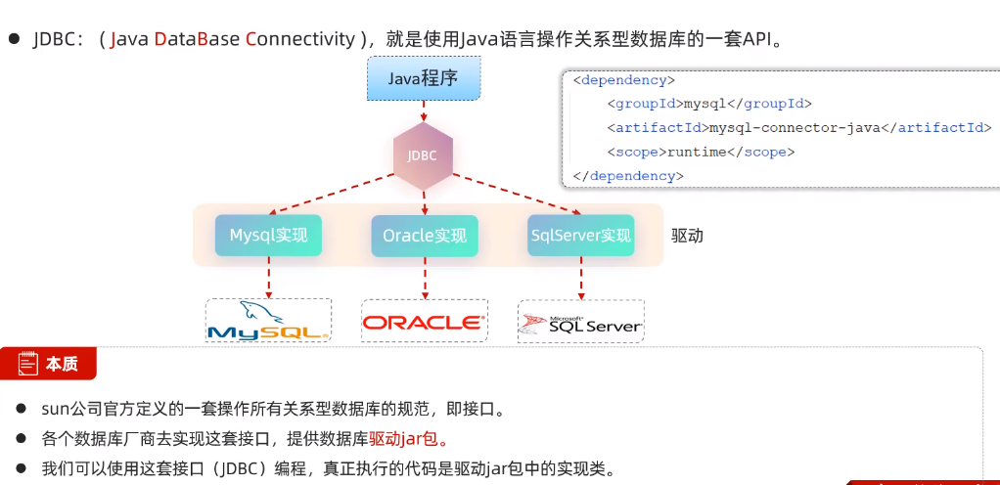
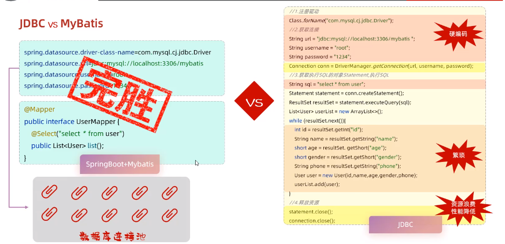
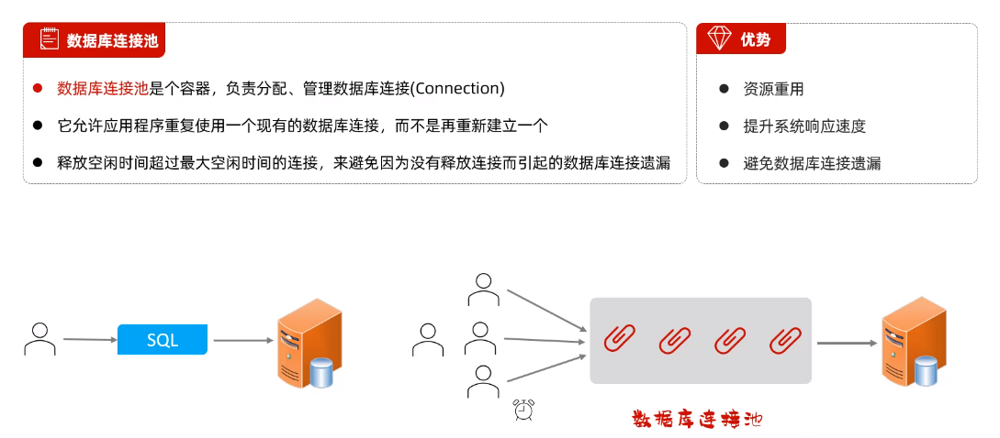
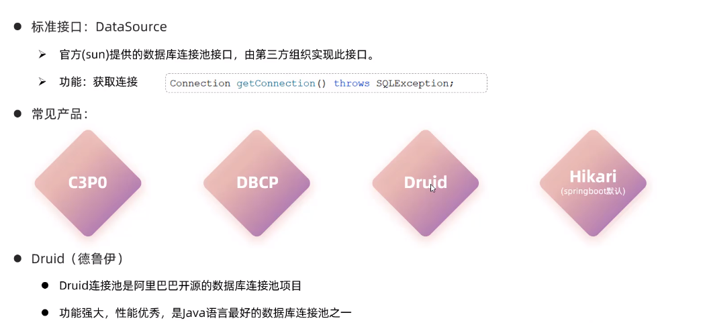
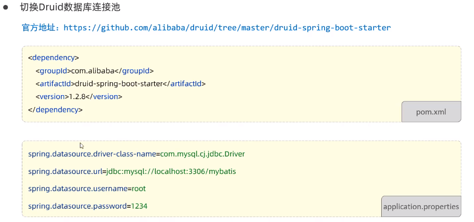
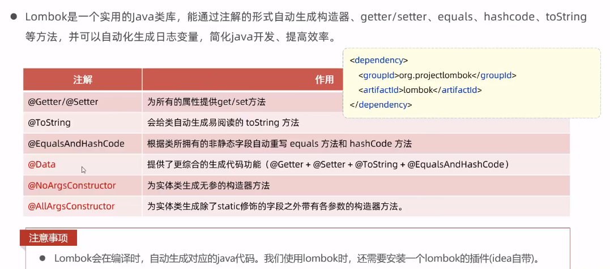

# Mybatis入门

## 什么是Mybatis

## 入门程序

## 数据库连接

* Driver：数据库驱动，MySQL为数据库驱动类的类名，若需连接MySQL数据库，则数据库的类名是固定的，为：com.mysql.cj.jdbc.Driver
* URL：
  * jdbc:mysql://是协议部分，是固定的；
  * localhost:3306代表了要连接的是哪个数据库服务器，表示本机的3306端口
  * mybatis表示要连接哪个数据库

### 数据库连接四要素

application.properties文件：

## 配置SQL提示

>在idea2023版本中，应当首先设置方言为MySQL，接着右键MySQL语句选择显示上下文操作，选择语言注入设置，将语言改为MySQL

## JDBC

>JDBC即sun公司提供的一套操作关系型数据库的API（规范），各数据库公司提供对应的实现，也称为数据库驱动，而由于原始的API较为繁琐，因此可使用Mybatis作为持久层框架用来对JDBC进行封装，从而提高性能

### JDBC vs Mybatis

## 数据库连接池

### 切换数据库连接池

在springboot中默认使用的连接池是Hikari连接池

>只需添加Druid的相关依赖即可

## lombok

