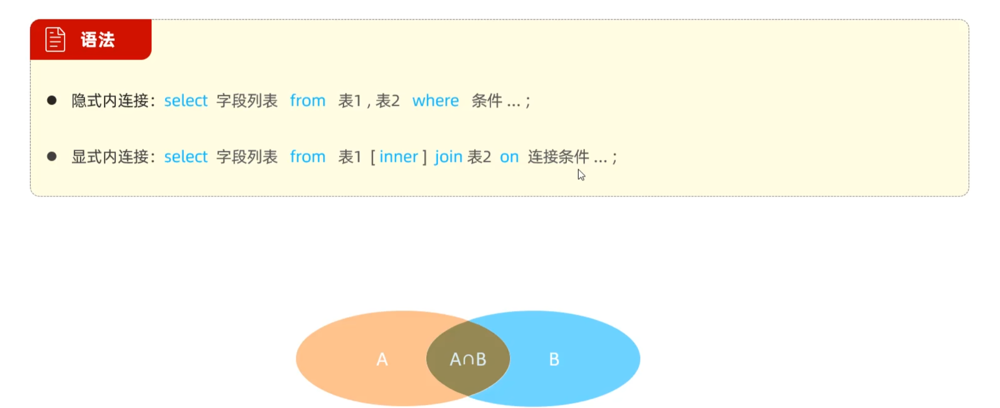

# 多表查询

## 概述


## 内连接




>当表名过长时，可为表起别名

>显式连接使用 JOIN 关键字指定连接操作，更直观明了

## 外连接


>左外连接包含了左表所有的数据，因此即使左表在右表中的数据对应为null，也能查询得到，同右外连接


>在实际开发中较常使用左外连接，因为二者可以互相转换

## 子查询

### 标量子查询


### 列子查询


>可使用in代替or

### 行子查询


>当子查询语句出现多次时，会影响sql语句的性能，因此可以对b语句进行性能优化

上述语句可转化为下列语句：


最终转换为：

```sql
select * from tb_emp where (entrydate,job)=(select entrydate,job from tb_emp where name = '韦一笑');
```

### 表子查询


>表子查询主要是将第一次查询的结果作为一张临时表来使用


