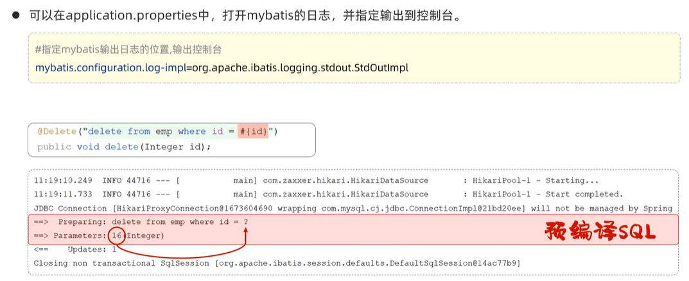
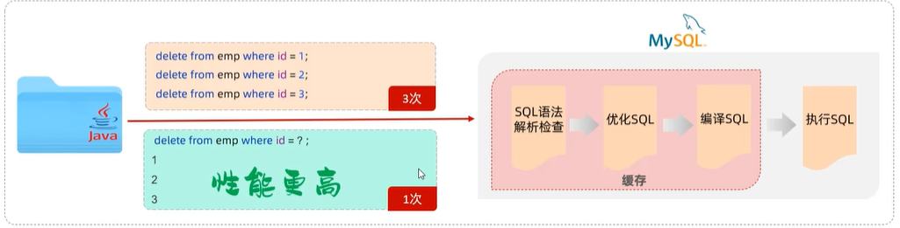
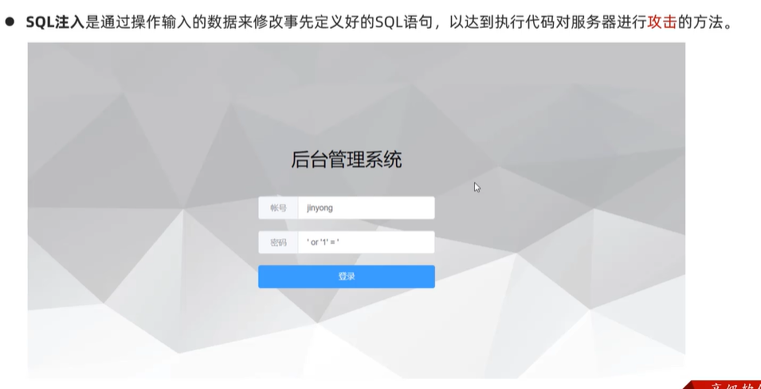
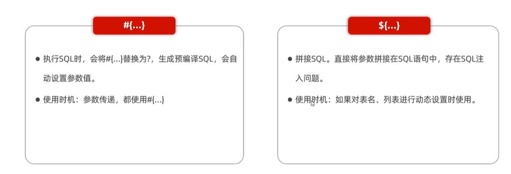

# Mybatis基础操作（删除）

## 删除操作

使用#{}表示此处可接收一个参数，增加了代码灵活性

若有返回值，则代表影响了多少条数据（使用较少）

## 预编译SQL

### 日志输出

* “ ？”指一个占位符，负责接收Parameters中的16
* Updates指影响的SQL行数

### 使用预编译SQL的好处

* 性能更高
* 更安全（防止SQL注入）

#### 缓存

即使参数不同，若SQL语句相同，也可以直接使用缓存中已执行过的SQL语句结果进行使用

#### SQL注入

>通过预编译SQL可防止SQL注入问题

### 参数占位符

因此使用#{}可防止SQL注入问题，而${}尽量对表名或列表动态使用