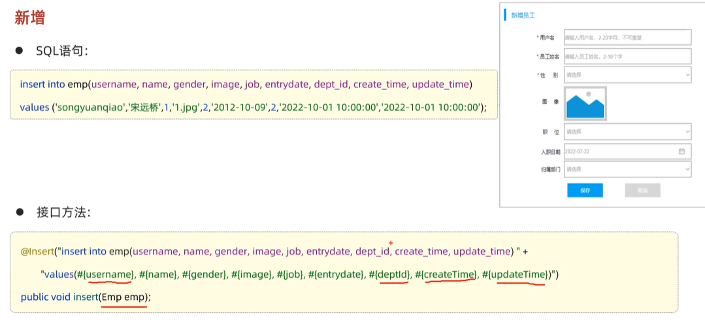
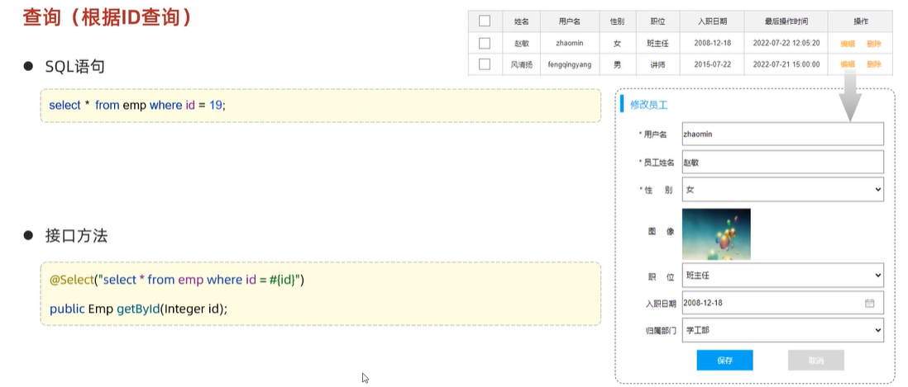

# Mybatis基础操作（新增）

先将各属性值存入到对象当中，再将对象提交到SQL语句当中

>注意，应当同时修改create_time和update_time

## 获取新增数据的主键返回值

不使用@Options时，此时若输出主键，则会返回null；因为主键一般是数据库自
增添加，不需要程序员手动输入，因此需要添加@Options注释，此时id属性将会
被自动赋值

# Mybatis基础操作（更新）

>注意，此时只需修改update_time，不用修改create_time

# Mybatis基础操作（查询）

## 根据ID查询

### 数据封装

>即是为了解决解决Mybatis对实体类驼峰命名属性（personAddr）和数据库字段（person_addr）匹配不上的问题

解决方法：

推荐使用第三种，开启驼峰命名的方法

## 条件查询

* 在关键字like后面，两个%之间不能使用#{}，因为会被替换为?，而?出现在引号内会出现错误
* 而使用${}会有SQL注入的问题
* 因此可使用concat关键字

### 参数名说明（@Param）

>需要在参数列表中使用@Param注释标注，使得参数列表中的参数与SQL语句中的参数相对应