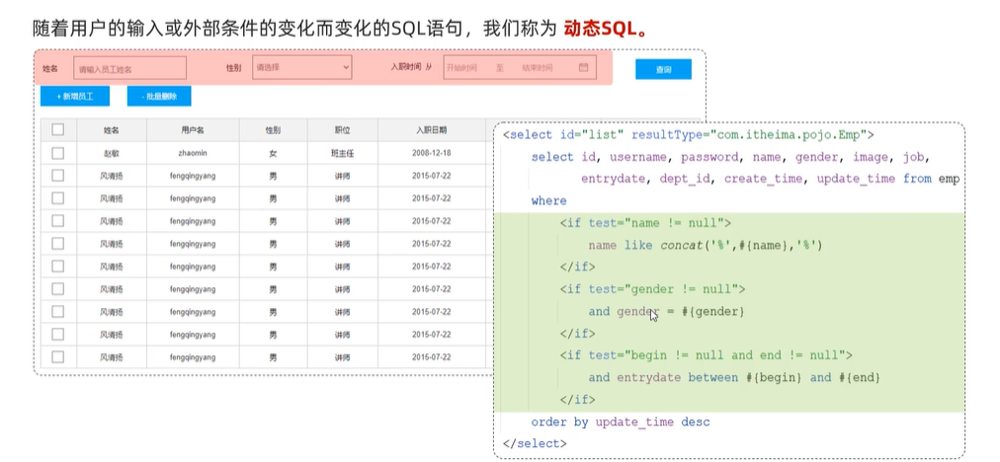
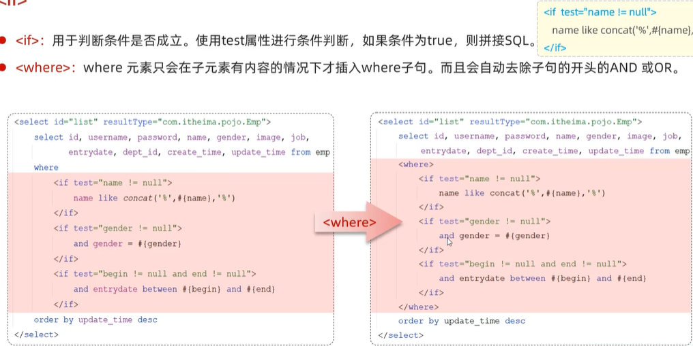
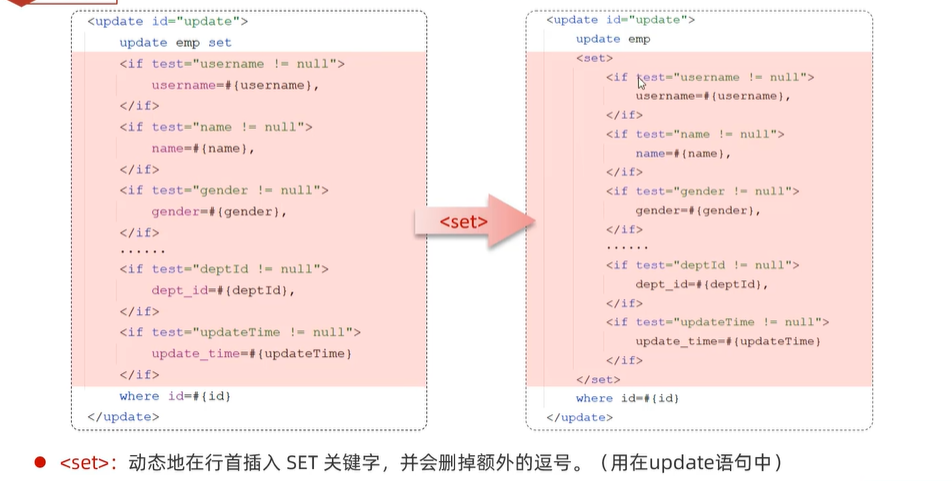
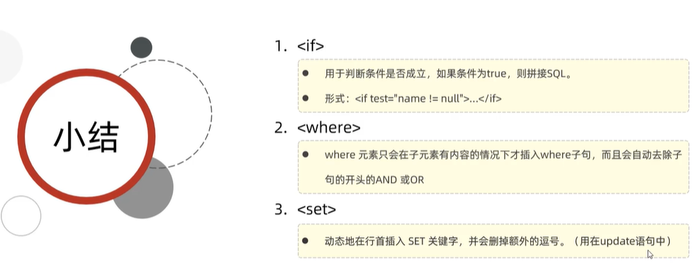
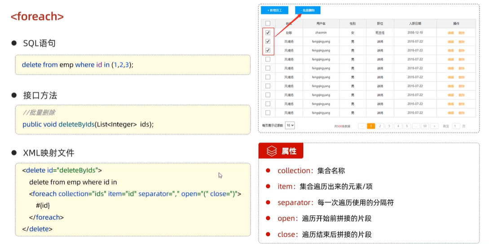
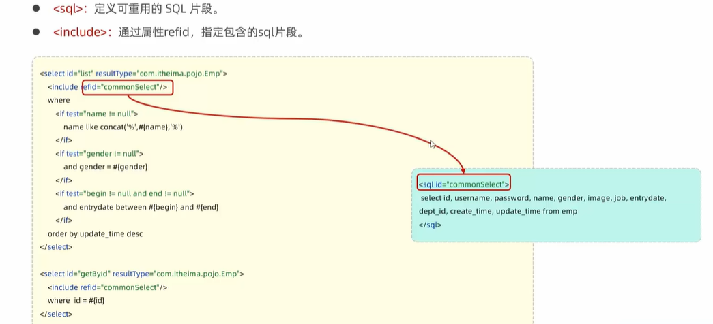

# 动态SQL

>标签的作用：将原本一句完整的sql语句拆分成一段固定的语句和一段可变的标签内容

## if标签和where标签

>使用if标签后，若此时传入的参数为null，则该该sql语句片段将不会执行，null值也不会传入sql语句中

## set标签

## 小结

## foreach标签

>主要用在批量操作当中

item可为任意名称，只需与底下#{}中的名称相对应即可

## sql标签

>增加代码的复用性

