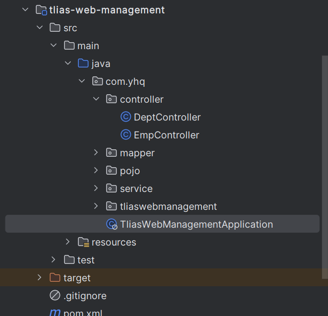
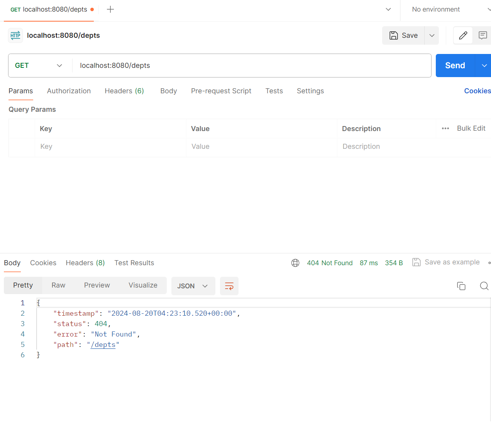
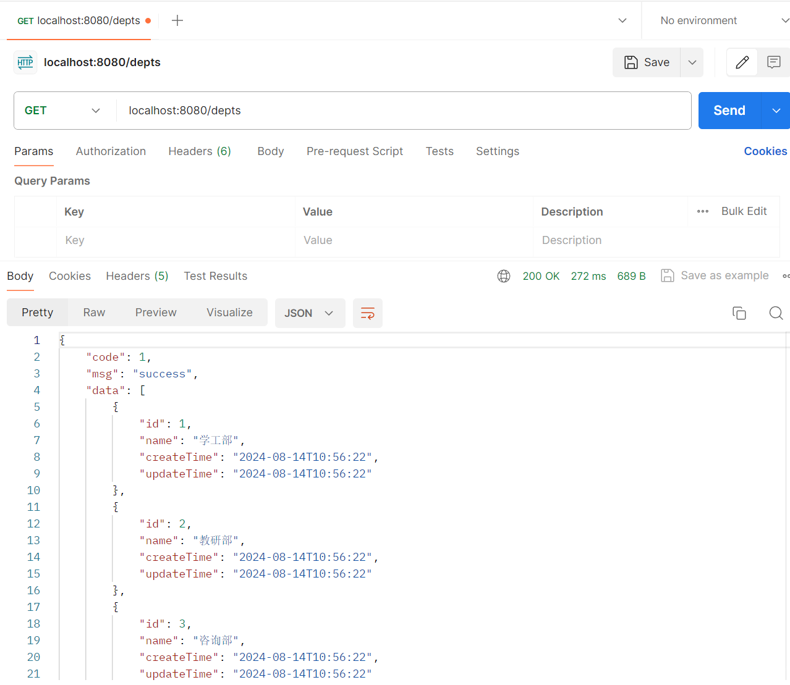
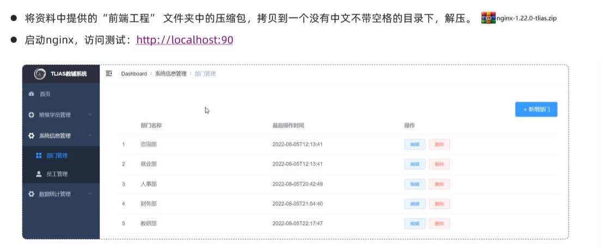
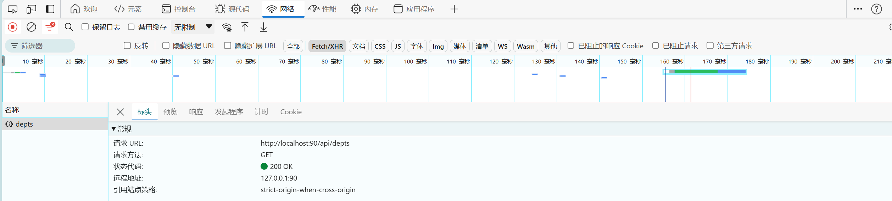
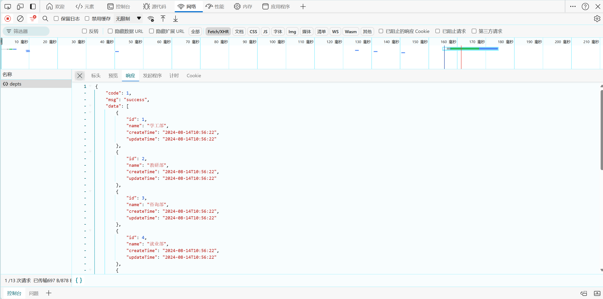
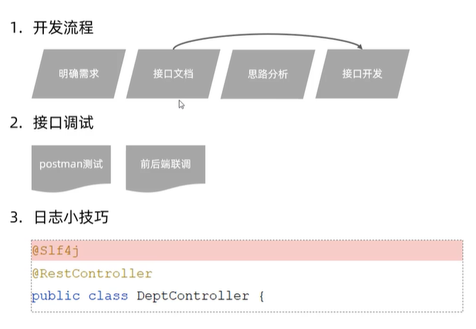

# 部门管理

## 日志记录

在类上使用@Slf4j后，可直接使用log.info()代替system.out.println

## @RestController

其中含有的@ResponseBody注解可将返回的结果转为JSON格式

## @RequestMapping

* value属性用于指定请求路径
* method属性用于指定请求方式

### @RequestMapping衍生注解

@GetMapping("/")，@PostMapping("/")等

## 错误案例

由于刚开始时将启动类放置在了tliaswebmanagement这个包下，导致启动项目以后再使用postman出现了404的报错，而404找不到资源，无非就是接口路径，提交方式、参数类型、返回结果类型有问题。经过查验后发现是启动类的问题

>要将Application类放在最外侧,即包含所有子包spring-boot会自动加载启动类所在包下及其子包下的所有组件

## 前后端联调

启动后端java代码后，可显示数据在前端页面中

使用开发者工具观察到发起的请求depts，以及响应回来的数据，经过前端渲染后，将响应回来的数据展示在表格中

## 小结

